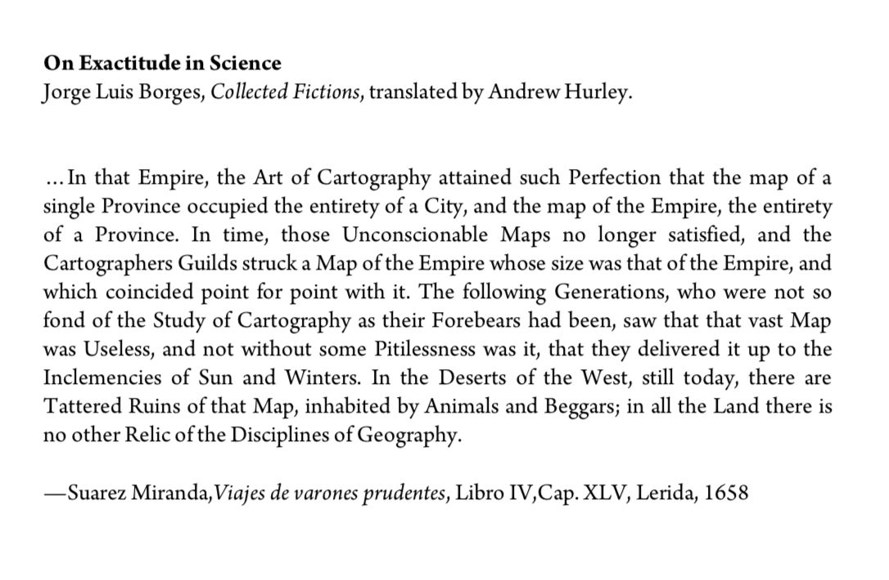

#### from Borges (the original source?)

### maps as mental models

#### from [Experimental History](https://www.experimental-history.com/p/face-it-youre-a-crazy-person)
>"The Coffee Beans Procedure is a way of doing what every other business plan does, but faster, because imaginations are limited; they can't include all details at once. **Otherwise you run into Borges' map problem—if you want a map that contains all the details of the territory that it's supposed to represent, then the map has to be the size of the territory itself. Unpacking is a way of re-inflating all the little particulars that had to be flattened so your imagination could produce a quick preview of the future, like turning a napkin sketch into a blueprint.**"

#### from [Farnam Street](https://fs.blog/map-and-territory/)
> In order to use a map or model as accurately as possible, we should take into account three important principles:
>     1. Reality is the ultimate update.
>     2. Consider the cartographer.
>     3. Maps can influence territories.

#### from The Marginalian, on lessons worth learning:
> **11.** A reflection originally offered by way of [a wonderful poem about pi](https://themarginalian.us2.list-manage.com/track/click?u=13eb080d8a315477042e0d5b1&id=80dc9bac2e&e=01af1bb07e): **Question your maps and models of the universe, both inner and outer, and continually test them against the raw input of reality**. Our maps are still maps, approximating the landscape of truth from the territories of the knowable — incomplete representational models that always leave more to map, more to fathom, because the selfsame forces that made the universe also made the figuring instrument with which we try to comprehend it.

### maps of knowledge + science
from Sri Kosuri on Twitter: "*The map is not the territory* — whenever I see one of these big mapping exercises in biology, I'm reminded of this story from Lewis Carroll (*Sylvie and Bruno Concluded, Chapter XI, London, 1893*)
>"What a useful thing a pocket-map is!" I remarked.
	"That's another thing we've learned from your Nation," said Mein Herr, "map-making. But we've carried it much further than you. What do you consider the largest map that would be really useful?"
	"About six inches to the mile."
	"Only six inches!" exclaimed Mein Herr. "We very soon got to six yards to the mile. Then we tried a hundred yards to the mile. And then came the grandest idea of all! We actually made a map of the country, on the scale of a mile to the mile!"
	"Have you used it much?" I enquired.
	"It has never been spread out, yet," said Mein Herr: "the farmers objected: they said it would cover the whole country, and shut out the sunlight! So we now use the country itself, as its own map, and I assure you it does nearly as well."

#### from David Foster Wallace's [wallace-everything-and-more](../media/wallace-everything-and-more.md)
- "A function, or *mapping*, is an abstraction of variables"
> Not until Galileo would people understand that velocity is not a quality of the thing moving, but rather an abstract process representable by the schoolboy function r=d/t

#### via [ehrenreich-desert-notebooks](../media/ehrenreich-desert-notebooks.md), a quote from Walter Benjamin:
>“All human knowledge takes the form of interpretation.”

#### [houellebecq-the-map-and-the-territory](houellebecq-the-map-and-the-territory.md)

### geographical maps
#### [How Maps Lie](https://www.outsideonline.com/outdoor-adventure/exploration-survival/how-maps-lie/)
- "Every map is drawn based on a hierarchy of information: it includes the most relevant details and subtracts the rest based on what the map is ultimately intended for."
- "As we navigate the world, we should ask ourselves: who made this map and how, with what sources and what authority? What’s been modified? What’s been left out?"

#### from Wendell Berry in [berry-the-world-ending-fire](../media/berry-the-world-ending-fire.md):
- "And is the natural world subject to limitless homogenization? There are, after all, southern species of plants and animals that will not thrive in the north, and vice versa. This ‘metaregion,’ this region ‘without resort to geography,’ is a map without a territory, which is to say a map impossible to correct, a map subject to become fantastical and silly like that Southern chivalry-of-the-mind that Mark Twain so properly condemned. How this ‘metaregion’ could resist homogenization and ‘unnatural consensus’ is not clear. At any rate, it abandons the real region to the homogenizers: You just homogenize all you want to, and we will sit here being Southern in our minds…"
- "The test of imagination, ultimately, is not the territory of art or the territory of the mind, but the territory underfoot. That is not to say that there is no territory of art or of the mind, only that it is not a separate territory. It is not exempt either from the principles above it or from the country below it. It is a territory, then, that is subject to correction – by, among other things, paying attention. To remove it from the possibility of correction is finally to destroy art and thought, and the territory underfoot as well. Memory, for instance, must be a pattern upon the actual country, not a cluster of relics in a museum or a written history. What Barry Lopez speaks of as a sort of invisible landscape of communal association and usage must serve the visible as a guide and as a protector; the visible landscape must verify and correct the invisible. Alone, the invisible landscape becomes false, sentimental, and useless, just as the visible landscape, alone, becomes a strange land, threatening to humans and vulnerable to human abuse."